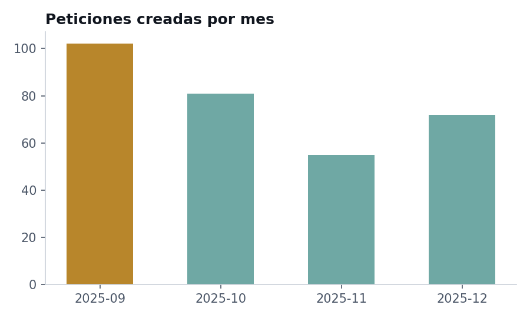
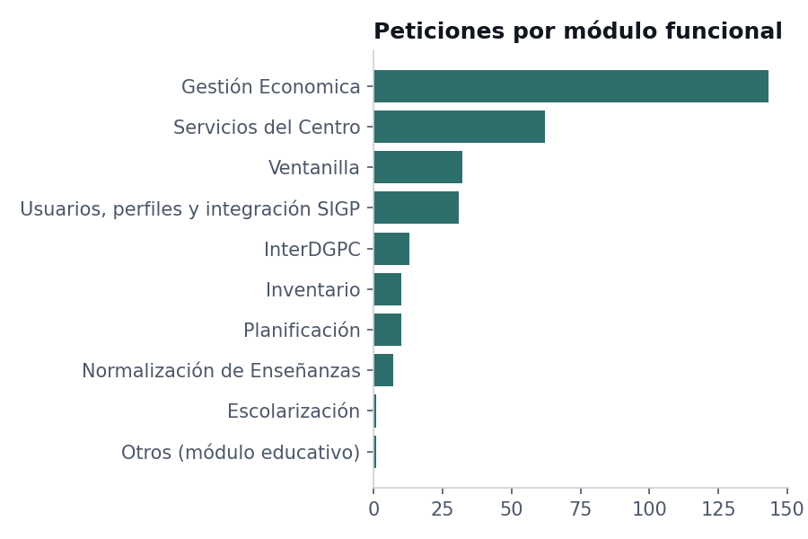
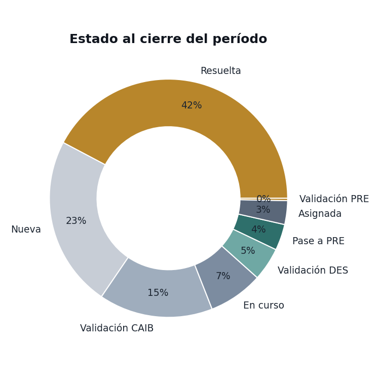
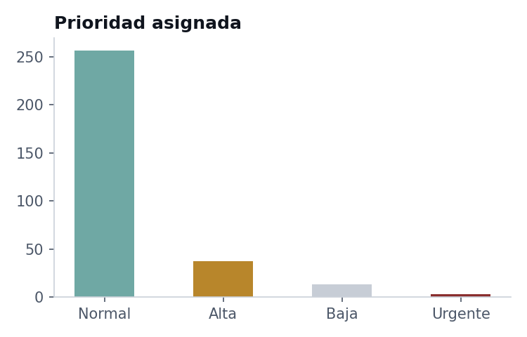
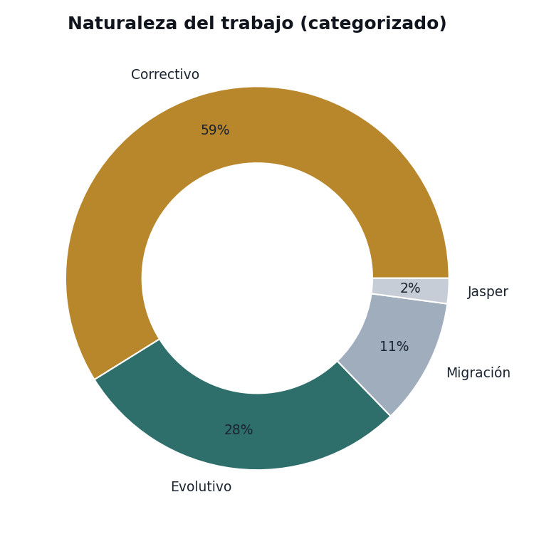
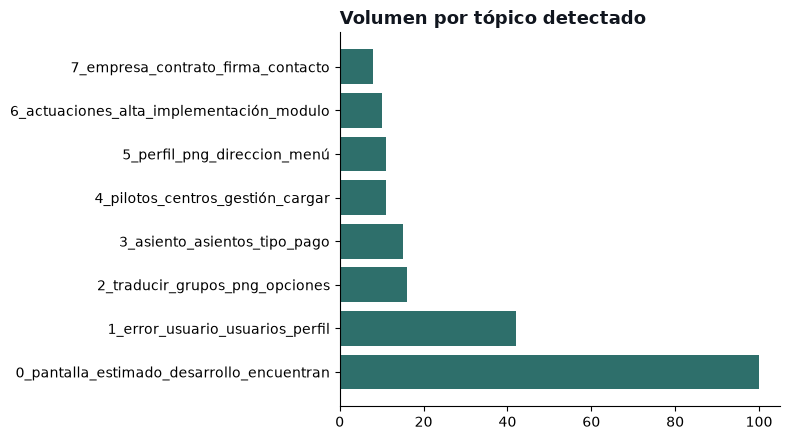

# Del ticket al patrón — Análisis operativo de un sistema de gestión pública

**310 peticiones no son ruido: son el mapa de dónde falla un sistema.**

Un trimestre (sep–dic 2025) de tickets funcionales en una plataforma de administración electrónica para el sector educativo, leído como lo que es: una fuente de datos operativos que puede orientar decisiones, no solo una bandeja de entrada.

🔗 **[Ver el case study interactivo](https://gdaguerre-dot.github.io/redmine-ops-analytics/)** · 📓 [Ver el notebook de análisis](notebook/redmine_ticket_analysis.ipynb)

---

## Contexto

Como Analista Funcional en un proyecto de administración electrónica orientado a centros educativos, parte del trabajo diario es relevar, clasificar y dar seguimiento a las peticiones que llegan desde usuarios finales hasta que quedan resueltas. Este proyecto toma un recorte real de esa gestión — un trimestre completo — y lo trata como un dataset operativo, con las mismas preguntas que se le harían a cualquier proceso de negocio: ¿cuándo llega el trabajo?, ¿dónde se concentra?, ¿qué tan rápido se resuelve?, ¿qué tipo de esfuerzo predomina?

> **Nota de confidencialidad:** los datos publicados en este repositorio fueron anonimizados y reducidos a campos estructurales (fecha, módulo, estado, prioridad, categoría). Se excluyeron nombres de personas, asuntos y descripciones de tickets, y cualquier referencia al sistema o al organismo público específico. El dataset original completo no se publica.

## Hallazgos principales

| Pregunta | Hallazgo |
|---|---|
| ¿Hay estacionalidad? | Septiembre concentra ~33% del volumen trimestral — coincide con el arranque del curso escolar |
| ¿Dónde se concentra el trabajo? | Un módulo explica ~46% de las peticiones — más del doble que el segundo en volumen |
| ¿Cuánto está resuelto? | 42% en estado *Resuelta* al cierre, con varias etapas de validación intermedias |
| ¿Predomina lo urgente? | No — 83% de las peticiones son prioridad *Normal* |
| ¿Se corrige o se construye? | El trabajo correctivo duplica al evolutivo (58% vs 28%) |
| ¿Qué módulo genera más fricción, no solo más volumen? | Los temas ligados a gestión económica concentran la mayor proporción de sentimiento negativo (hasta 43%), muy por encima del 13% promedio — el mismo módulo que ya lideraba en volumen |

Ver el desarrollo completo de cada hallazgo en el [case study](https://gdaguerre-dot.github.io/redmine-ops-analytics/) o en el [notebook](notebook/redmine_ticket_analysis.ipynb).

## Estructura del repositorio

```
redmine-ops-analytics/
├── README.md                          este archivo
├── data/
│   ├── tickets_anonimizado.csv         dataset público (7 columnas estructurales, 310 filas)
│   └── topicos_sentimiento_resumen.csv  tópicos + sentimiento agregado (fase 2, sin texto original)
├── notebook/
│   ├── redmine_ticket_analysis.ipynb   análisis reproducible (pandas + matplotlib)
│   └── nlp/
│       └── topic_sentiment_analysis.ipynb   BERTopic + sentiment (español) — corre local, sobre texto no publicado
├── site/
│   └── index.html                     case study interactivo (HTML + Chart.js), publicado vía GitHub Pages
└── assets/
    └── *.png                          gráficos exportados, usados en este README
```

## Cómo reproducirlo

```bash
git clone https://github.com/gdaguerre-dot/redmine-ops-analytics.git
cd redmine-ops-analytics
pip install pandas matplotlib jupyter
jupyter notebook notebook/redmine_ticket_analysis.ipynb
```

El notebook lee `data/tickets_anonimizado.csv` y regenera los cinco gráficos del análisis con las mismas conclusiones que el case study.

## Vista previa

<p align="center">
  
  
</p>
<p align="center">
  
  
  
</p>
<p align="center">
  
</p>

## Stack

`Python` · `pandas` · `matplotlib` · `HTML/CSS` · `Chart.js` · `BERTopic` · `pysentimiento` · `Redmine` (fuente de datos original)

## Próximos pasos

- [x] Topic modeling (BERTopic) + análisis de sentimiento (español, `pysentimiento`) sobre el texto de las peticiones — ver [`notebook/nlp/topic_sentiment_analysis.ipynb`](notebook/nlp/topic_sentiment_analysis.ipynb). Corre sobre el texto original en un entorno local (no incluido en este repo por confidencialidad) y publica únicamente resultados agregados en `data/topicos_sentimiento_resumen.csv`.

---

**Gerónimo Daguerre** · Analista Funcional · BI & Data Analytics
[LinkedIn](https://linkedin.com/in/gerodaguerre) · gerodaguerre@gmail.com

